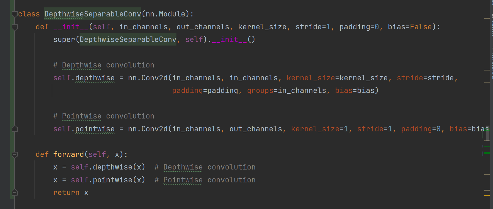
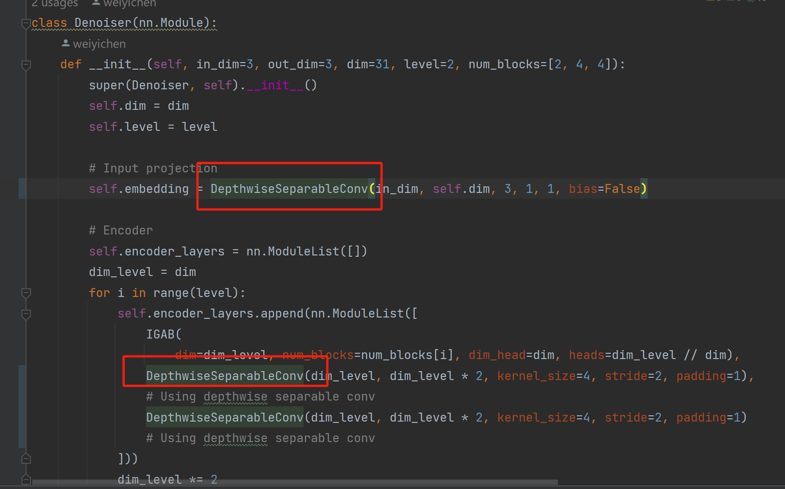
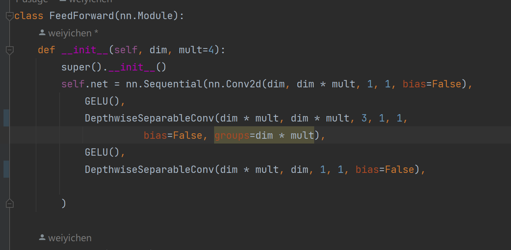
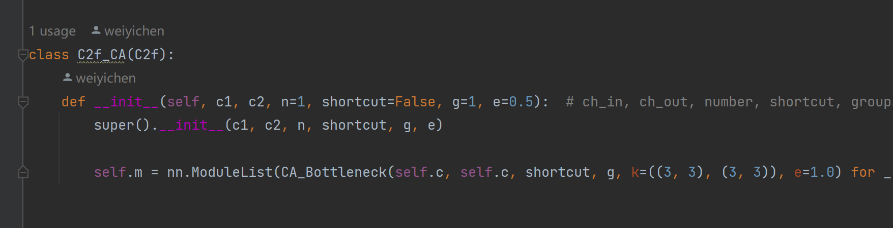
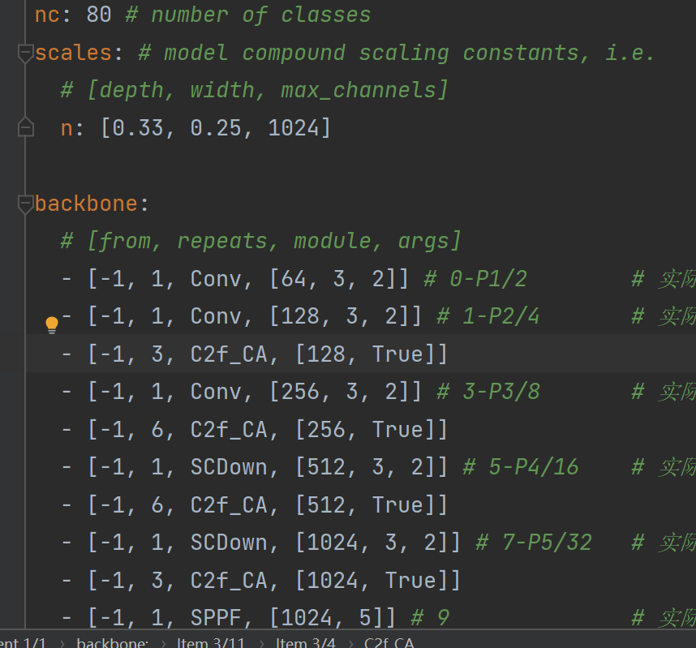
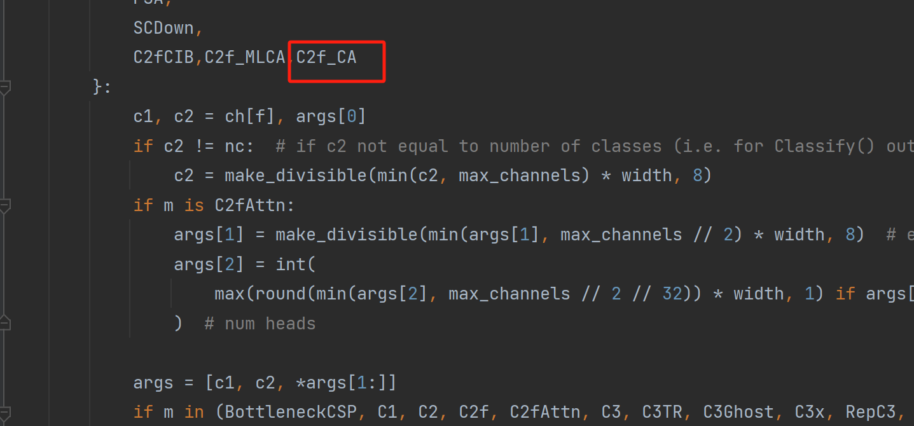
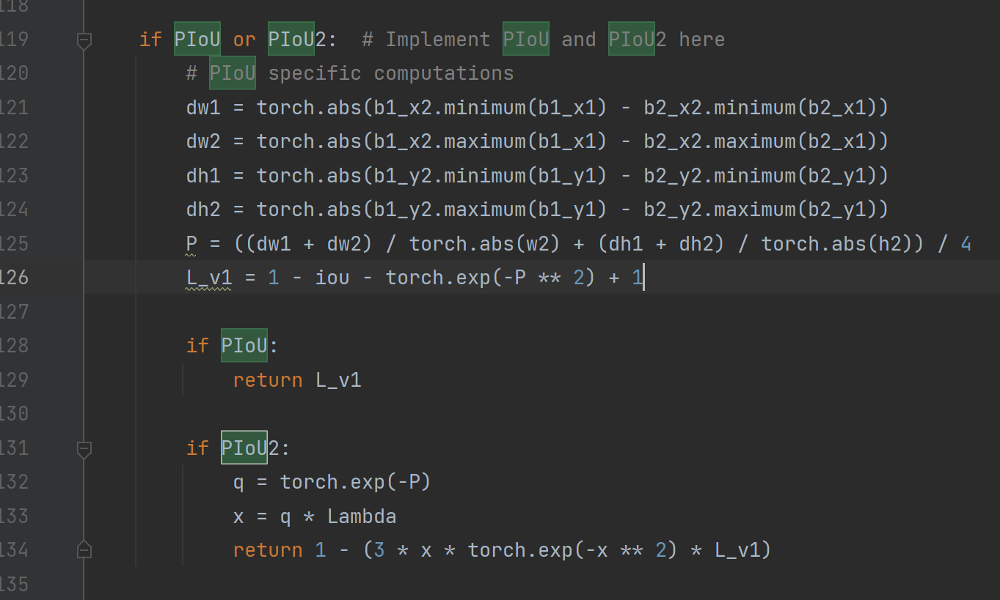

# enhance_detect
夜间监控人脸图像增强和检测
分成两个文件夹一个是Retinexformer-DS模型另一个是YOLOv10n-CA-PIoU
对于Retinexformer-DS模型我的改进代码分别位于
./Retinexformer-DS/basicsr/models/archs/RetinexFormer_arch.py
其中对于腐蚀恢复器模块修改的代码位于

对FNN的修改的代码位于

对于YOLOv10n-CA-PIoU模型我的改进代码分别位于
CA部分
./YOLOv10n-CA-PIoU/ultralytics/nn/modules/CA.py

./YOLOv10n-CA-PIoU/ultralytics/cfg/models/v10/yolov10n-CA.yaml

./YOLOv10n-CA-PIoU/ultralytics/nn/tasks.py
其中的parse_model方法中添加
PIoU部分
./YOLOv10n-CA-PIoU/ultralytics/utils/metrics.py

